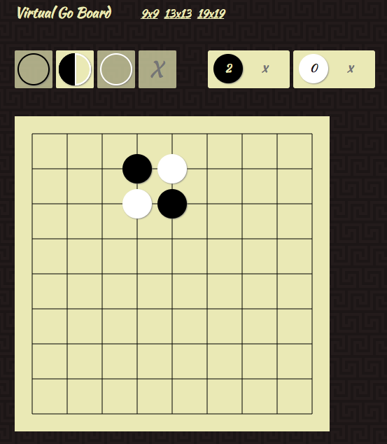

# A Virtual Go Board

A virtual Go board you can use to play the game, test your thoughts with or teach an another player.

You can try it here: https://paasar.github.io/virtual-go-board/

Developed with PureScript.

## Requirements

* Node https://nodejs.org/en/
* PureScript `npm install -g purescript`
* Pulp build tool `npm install -g pulp`
* psc-package dependency manager `npm install -g psc-package`

## Build

Install dependencies

    psc-package install

Run build

    pulp build -O --to static/js/index.js

Then open `static/index.html` in your favorite browser.

## Deploy

After build copy everything under `static` to the server.

## Ideas for further developement

   * Load/save state from/to a file
   * Tree of the game played
   * Multiplayer through network
   * AI opponent in a server
   * AI suggestions for moves
   * An interactive guide that teaches the rules
